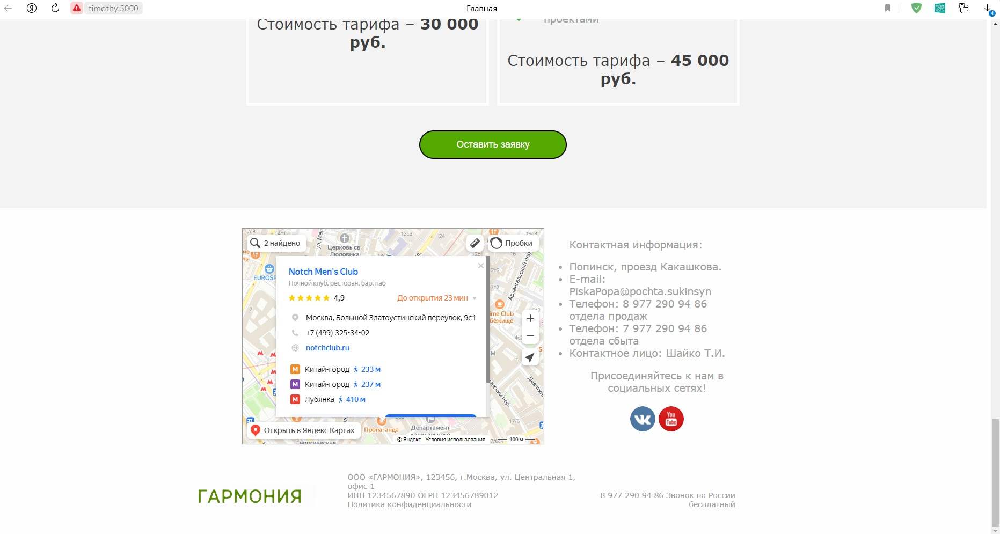

<h1>nodejs-css</h1>
 
Here is a project in which I tried to reproduce in maximum detail the template of a one-page business card site: <a href="https://169580.lp.tobiz.net/?v=349868&show_install_panel=true">https://169580.lp.tobiz.net/?v=349868&show_install_panel=true#anchor2</a>.

 And these are several screenshots of the original site:

 And these are screens of my project site:

 There is also a server side written on NodeJS framework. The code uses "http" module but not popular "Express" module. I use "http" just for practics.

 If you want to run the project, you should install node.js on your computer and then run approximately next command (in "command line" in project directory): 
 <code text-align="center">..///> node server_side.js</code>

  Then open your browser and type into top address line your <i>hostname</i> or <i>ip-address</i> lile that: 
  <code align="center" padding="10px">192.168.99.103:5000</code> 
  <code align="center" padding="10px">myPC:5000</code>

 <b>That's all, friend! Thanks for your attention. Good mood to you and have a nice day! :)</b>

